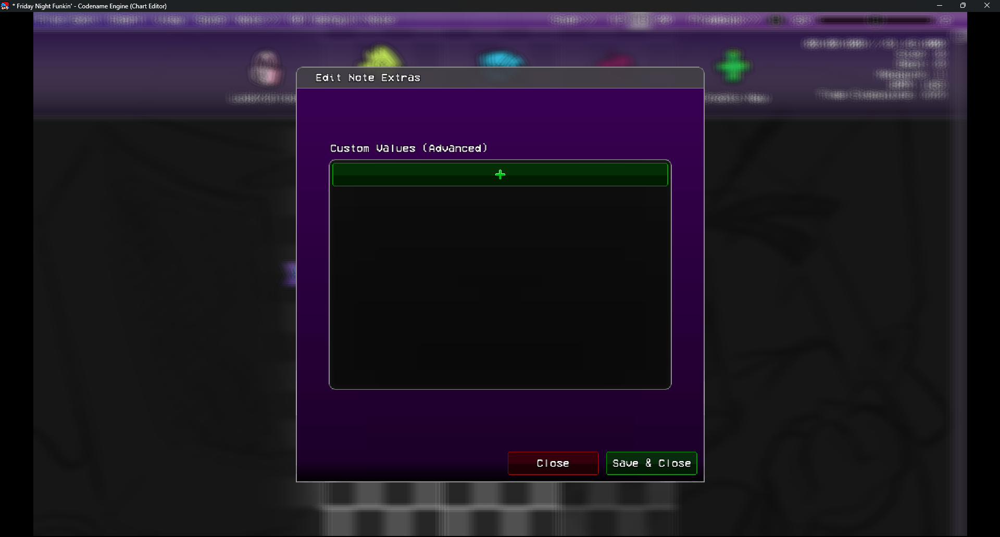
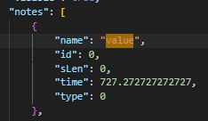
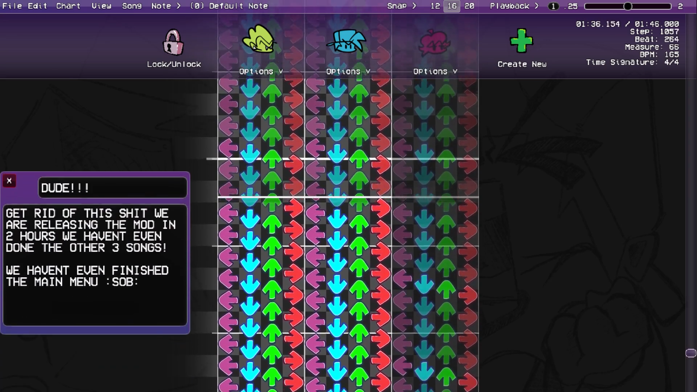
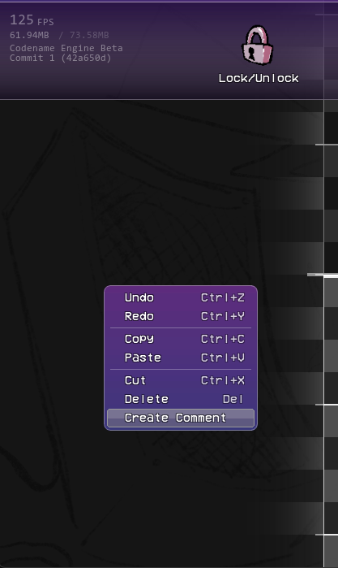
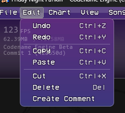

# LJ's Charter Quality of Life Changes
This addon (currently) adds 2 features to the Codename Engine Chart Editor.

# Note Extra Chart Editor
Allows editing the `extra` variable for a Note in the Chart Editor.
<header align="center">
    
</header>

I used it to allow my Custom Note Types to have different effects, when I wanted to.
You could edit the chart manually to add this, but this makes it easier.

## Showcase
<header align="center">
    
</header>

## Why it works?
Codename Engine Actually already does most of the work, I just made a friendly UI for it.
inside your Chart, if your note has any data inside of it, it automatically goes into the `extra` variable.
<header align="center">
    
</header>

# Charter Comments
You can now add comments to your chart, leaving reminders for yourself, or others to see!

Currently its limited to a specific size, but its supposed to be simple and easy to use.

You can add comments by Right Clicking and selecting `Create Comment`.

<header align="center">
    
    
</header>
